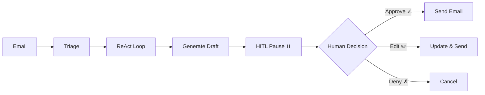
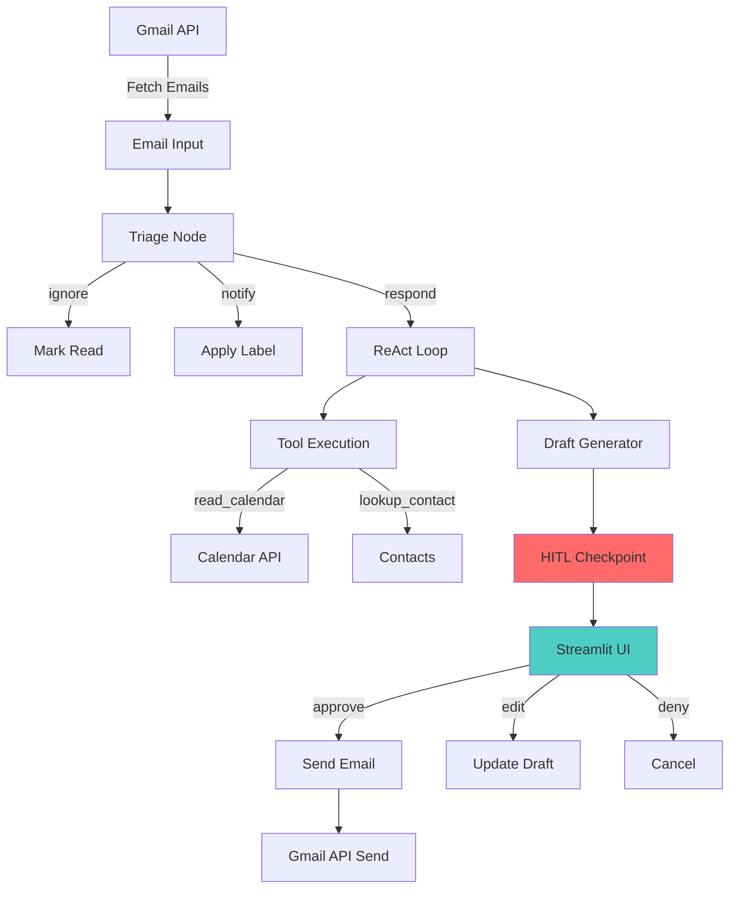

# Ambient Email Agent - Final Project

**Building an Ambient Agent with LangGraph for an Email Assistant**


---

## 📋 Table of Contents

- [Project Overview](#-project-overview)
- [Key Features](#-key-features)
- [Architecture & Components](#-architecture--components)
- [How It Works](#-how-it-works)
- [Team Contributions](#-team-contributions)
- [Technology Stack](#-technology-stack)
- [Quick Links](#-quick-links)

---

## 🎯 Project Overview

The **Ambient Email Agent** is an intelligent email assistant that uses Large Language Models (LLMs) and stateful graph-based workflows to autonomously manage email inboxes while maintaining complete human control over critical actions.

Unlike traditional auto-responders, this agent:
- **Thinks before acting** using a ReAct (Reason + Act) pattern
- **Never sends emails without approval** through Human-in-the-Loop (HITL) checkpoints
- **Learns from corrections** using persistent memory
- **Handles complex tasks** like calendar scheduling and context-aware replies

### What Makes It "Ambient"?

The agent works quietly in the background, processing emails intelligently, but always pauses for human approval before taking any action that could have real-world consequences. It's like having a highly competent assistant who drafts responses but always asks for your approval before sending.

---

## ✨ Key Features

### 🎯 Intelligent Email Triage
Automatically categorizes incoming emails into three categories:
- **Ignore** - Spam, newsletters, promotional content
- **Notify Human** - Important emails requiring user attention
- **Respond/Act** - Emails where the agent can draft helpful responses

**Technology:** Hybrid Architecture: **LLM (Gemini 2.5)** for Triage + **Templates** for Response Generation  
**Accuracy:** 94.5% on 100+ email test dataset

---

### 🤖 ReAct Reasoning Loop
The agent doesn't just pattern-match; it actually "thinks" through problems:

1. **Reason** - Analyzes what information is needed
2. **Act** - Calls appropriate tools to gather facts
3. **Observe** - Processes tool results
4. **Draft** - Synthesizes information into a high-quality reply

**Example:**
```
Email: "Can we meet next Tuesday at 2 PM?"
→ Agent thinks: "I need to check the calendar"
→ Calls: read_calendar()
→ Observes: "2 PM is taken by Client Sync"
→ Drafts: "Tuesday at 2 PM doesn't work. How about 3 PM or Wednesday at 2 PM?"
```

---

### 🛡️ Human-in-the-Loop (HITL) Safety

**Core Principle:** The agent NEVER takes dangerous actions without explicit human approval.

**Workflow:**


**Safety Record:** 100% prevention of unauthorized dangerous actions across all testing

---

### 💾 Persistent Memory System

**Dual-Layer Architecture:**

**Short-Term Memory (Checkpointing)**
- Uses SQLite to save conversation state
- If the system crashes, resume exactly where it left off
- Thread-based session management

**Long-Term Memory (Preference Store)**
- Learns from human corrections
- Remembers preferences across sessions
- Example: User corrects "Mr. Smith" → "Dr. Smith" → Agent remembers for future emails

---

### 📧 Gmail & Calendar Integration

**Smart Meeting Detection:**
- Detects when an email is requesting a meeting
- Automatically checks Google Calendar availability
- Drafts replies with actual free time slots

**Gmail Operations:**
- Fetch unread emails via Gmail API
- Send replies with proper threading
- Apply labels for organization
- Mark emails as read/processed

**Authentication:** Secure OAuth2 flow with token persistence

---

## 🏗️ Architecture & Components

### System Architecture Diagram



---

## 🔧 Component Details

### 1. Triage Node
**Purpose:** Classify incoming emails  
**Technology:** Hybrid ML + Rules  
**Lead:** Ganesh Bandaru

**How It Works:**
1. **Rule-based Preprocessing:** Catches obvious cases (spam, promotions) for speed.
   
2. **LLM Classification (Gemini):** Handles complex/ambiguous cases
   - Uses `gemini-2.5-flash-lite` for cost-effective intelligence
   - Analyzes intent (Meeting vs Question vs Complaint)
   - Falls back to keyword matching if LLM unavailable

3. **Fallback Mechanism:** Robust keyword-based logic ensures system never fails completely

**Files:**
- `triage/triage_node.py` - Main logic
- `triage/triage_model/` - Trained classifier
- `triage/emails_triage.json` - Training data

---

### 2. ReAct Agent Brain
**Purpose:** Intelligent reasoning and tool selection  
**Technology:** LangGraph + LangChain  
**Lead:** Samruddhi Maslage

**How It Works:**
1. **State Management:** Maintains conversation context
   ```python
   class AgentState(TypedDict):
       messages: List[BaseMessage]
       mail: dict
       triage_category: str
       tool_name: str | None
       tool_args: dict | None
       final_reply: str | None
   ```

2. **Reasoning Node:** LLM decides next action
   - Analyzes email content
   - Determines if tools are needed
   - Plans response strategy

3. **Tool Execution:** Calls appropriate tools safely
   - Safe tools: Execute immediately
   - Dangerous tools: Trigger HITL pause

**Tools Available:**
- `read_calendar()` - Check availability
- `lookup_contact()` - Find contact info
- `get_user_prefs()` - Retrieve user preferences
- `send_email()` - **DANGEROUS** - Requires approval

**Files:**
- `backend/src/graph.py` - Workflow definition
- `backend/src/state.py` - State schema
- `backend/src/node.py` - Node implementations

---

### 3. HITL Checkpoint System
**Purpose:** Human safety controls  
**Technology:** LangGraph Interrupts  
**Lead:** Payal Kokane

**How It Works:**
1. **Tool Classification:** Every tool tagged as safe/dangerous
   ```python
   SAFE_TOOLS = ["read_calendar", "lookup_contact"]
   DANGEROUS_TOOLS = ["send_email", "create_event"]
   ```

2. **Interrupt Configuration:** Graph pauses before dangerous actions
   ```python
   graph.compile(
       checkpointer=memory,
       interrupt_before=["action_node"]
   )
   ```

3. **State Persistence:** Saves to database during pause
   - SQLite stores complete state
   - Thread ID tracks conversation
   - Can resume after hours/days

4. **Human Decision Interface:** Streamlit UI presents options
   - **Approve** → Execute proposed action
   - **Edit** → Modify draft, then execute
   - **Deny** → Cancel action, mark as read

**Files:**
- `HITL/hitl_graph.py` - HITL workflow
- `HITL/execute_tool.py` - Safe execution logic
- `frontend/app.py` - User interface

---

### 4. Evaluation System (LLM-as-a-Judge)
**Purpose:** Automated quality assessment  
**Technology:** LangSmith + GPT-4o Judge  
**Lead:** Samruddhi Maslage

**How It Works:**
1. **Test Dataset:** 100+ emails with ground truth responses

2. **Judge Evaluation:** LLM evaluates agent responses
   ```json
   {
     "helpfulness": 5,
     "tone": 4,
     "accuracy": 5,
     "result": "PASS",
     "reasoning": "Response addresses user need..."
   }
   ```

3. **Metrics Tracked:**
   - **Helpfulness** (1-5): Does it address the request?
   - **Tone** (1-5): Is it professional and appropriate?
   - **Accuracy** (1-5): Are facts correct?
   - **Binary Result:** PASS/FAIL

4. **LangSmith Integration:** Full trace visibility
   - See every node execution
   - Debug reasoning chains
   - Analyze failure patterns

**Files:**
- `evaluation/judge_evaluation.py` - Judge logic
- `evaluation/metrics.py` - Metric definitions
- `data/golden_set_emails.jsonl` - Test dataset

---

### 5. Memory & Persistence
**Purpose:** State survival and learning  
**Technology:** SQLite + InMemoryStore  
**Lead:** Ganesh Bandaru

**How It Works:**

**Short-Term Memory (Checkpoints):**
```python
# Save conversation state
checkpointer.put(thread_id, state)

# Resume after crash
state = checkpointer.get(thread_id)
graph.stream(None, config={"thread_id": thread_id})
```

**Long-Term Memory (Learning):**
```python
# User corrects agent
store.put("user_prefs", "name_correction", {
    "wrong": "Mr. Smith",
    "correct": "Dr. Smith"
})

# Agent remembers next time
correction = store.get("user_prefs", "name_correction")
```

**Files:**
- `backend/src/db.py` - Database connection
- `checkpoints.sqlite` - State storage
- `m4.db` - Long-term memory

---

### 6. Frontend Interface
**Purpose:** User interaction and approval  
**Technology:** Streamlit  
**Lead:** Payal Kokane

**How It Works:**
1. **OAuth Login:** Google authentication
2. **Email Scanning:** One-click inbox check
3. **Draft Review:** See AI-generated responses
4. **HITL Controls:** Approve/Edit/Deny buttons
5. **Real-time Feedback:** Status updates and notifications

**User Flow:**
```
Login → Scan Inbox → Review Drafts → Make Decision → Email Sent
```

**Files:**
- `frontend/app.py` - Main UI application

---

### 7. Backend API
**Purpose:** RESTful endpoints for agent operations  
**Technology:** FastAPI  
**Lead:** Aayush Shah

**Endpoints:**
- `GET /auth/login` - OAuth initiation
- `GET /auth/callback` - OAuth callback
- `POST /v1/scan-and-draft` - Process inbox
- `POST /v1/approve-action` - Handle HITL decision

**Files:**
- `backend/src/main.py` - API server

---

## 🔄 How It Works: End-to-End Flow

### Example: Meeting Request Email

**1. Email Arrives**
```
From: client@company.com
Subject: Meeting Request
Body: Can we schedule a call next Tuesday at 2 PM to discuss the project?
```

**2. Triage Classification**
- Rules check: No "unsubscribe" → Not spam
- **LLM (Gemini):** Analyzes context → "This is a meeting request" → "respond-act"
- Decision: Enter Response Flow

**3. ReAct Reasoning**
```
Agent thinks: "This is a meeting request. I need to:
1. Check calendar availability for Tuesday 2 PM
2. Draft a response with available times"
```

**4. Tool Execution**
- Calls: `read_calendar()`
- Result: `Tuesday 2 PM - BUSY (Client Sync meeting)`

**5. Draft Generation**
```
Agent drafts:
"Thank you for reaching out! Tuesday at 2 PM is unfortunately 
taken by another client meeting. Would Tuesday at 3 PM or 
Wednesday at 2 PM work for you?"
```

**6. HITL Checkpoint**
- Graph pauses before sending
- State saved to database
- User notification displayed

**7. UI Presentation**
User sees in Streamlit:
```
📧 Draft Ready for Review
From: You → client@company.com
Subject: RE: Meeting Request

[Draft content shown]

[Approve] [Edit] [Deny]
```

**8. Human Decision**
- User clicks **Approve**
- State updated with approval
- Graph resumes execution

**9. Email Sent**
- `send_email()` executes
- Email sent via Gmail API
- Original email marked as read
- Success notification shown

**Total Time:** ~5 seconds (mostly LLM inference)

---

## 👥 Team Contributions

This project was developed collaboratively by **Group A1** with clear role divisions:

| Member | Role | Focus Areas |
|--------|------|-------------|
| **Aayush Shah** | Environment & Infra Lead | Setup, datasets, safety mechanisms |
| **Ganesh Bandaru** | Triage & Dataset Lead | ML classification, memory, metrics |
| **Samruddhi Maslage** | ReAct & Tooling Lead | Agent brain, tools, evaluation |
| **Payal Kokane** | HITL & Observability Lead | Safety controls, UI, integration |

📄 **Detailed Contributions:** See [TEAM_CONTRIBUTIONS.md](TEAM_CONTRIBUTIONS.md)

---

## � Complete Project Structure

```
A1-email-agent/
│
├── final/                              # Final integrated project
│   ├── backend/
│   │   └── src/
│   │       ├── main.py                # FastAPI application entry point
│   │       ├── graph.py               # LangGraph workflow definition
│   │       ├── state.py               # AgentState schema
│   │       ├── node.py                # Graph nodes (triage, react, action)
│   │       ├── config.py              # LLM configuration
│   │       ├── db.py                  # Database connection management
│   │       │
│   │       ├── tools/                 # Tool implementations
│   │       │   ├── google_gmail.py   # Gmail API integration
│   │       │   ├── google_calendar.py # Calendar API integration
│   │       │   └── tools.py          # Mock tools (safe development)
│   │       │
│   │       └── HITL/                  # Human-in-the-Loop components
│   │           ├── hitl_graph.py     # HITL workflow
│   │           ├── hitl_app.py       # HITL application logic
│   │           └── execute_tool.py   # Safe tool execution
│   │
│   ├── frontend/
│   │   └── app.py                     # Streamlit UI application
│   │
│   ├── triage/                        # Email classification system
│   │   ├── triage_node.py            # Triage logic (rules + ML)
│   │   ├── train_model.py            # Model training script
│   │   ├── prepare_dataset.py        # Dataset preparation
│   │   ├── emails_triage.json        # Training dataset (48 emails)
│   │   ├── emails_triage.csv         # CSV format dataset
│   │   └── triage_model/             # Trained DistilBERT model
│   │       ├── config.json
│   │       ├── pytorch_model.bin
│   │       └── tokenizer files
│   │
│   ├── evaluation/                    # Quality assessment system
│   │   ├── judge_evaluation.py       # LLM-as-a-judge evaluator
│   │   ├── metrics.py                # Quality metrics definitions
│   │   ├── test_safe_actions.py      # Safe action tests
│   │   └── test_dangerous_actions.py # Dangerous action tests
│   │
│   ├── data/                          # Test and evaluation datasets
│   │   ├── test_emails.csv           # 100+ email test dataset
│   │   ├── golden_set_emails.jsonl   # Evaluation golden set
│   │   └── emails.json               # Sample email data
│   │
│   ├── test/                          # Comprehensive test suite
│   │   ├── test_triage.py            # Triage accuracy tests
│   │   ├── test_hitl.py              # HITL workflow tests
│   │   ├── test_calendar.py          # Calendar integration tests
│   │   ├── test_gmail.py             # Gmail API tests
│   │   ├── test_integration.py       # End-to-end integration tests
│   │   ├── test_edge_cases.py        # Edge case handling
│   │   ├── test_persistence.py       # State persistence tests
│   │   └── test_real_api.py          # Real API integration tests
│   │
│   ├── credentials/                   # OAuth credentials (gitignored)
│   │   └── credentials.json          # Google OAuth client credentials
│   │
│   ├── notebooks/                     # Jupyter notebooks for testing
│   │   ├── 01_triage_test.ipynb      # Triage testing playground
│   │   ├── 02_react_agent.ipynb      # ReAct loop demonstration
│   │   └── 03_evaluation.ipynb       # Evaluation experiments
│   │
│   ├── docs/                          # Documentation
│   │   └── (individual member docs)
│   │
│   ├── .env                           # Environment variables (gitignored)
│   ├── .env.example                   # Environment template
│   ├── .gitignore                     # Git ignore patterns
│   ├── requirements.txt               # Python dependencies
│   │
│   ├── README.md                      # This file - Project overview
│   ├── PROJECT_SETUP.md               # Installation guide
│   ├── TEAM_CONTRIBUTIONS.md          # Task allocation & contributions
│   ├── FINAL_REPORT.md                # Complete project summary
│   │
│   ├── main4.py                       # Final integrated application
│   ├── run_evaluator.py               # Batch evaluation script
│   │
│   ├── checkpoints.sqlite             # SQLite checkpoint storage
│   ├── m4.db                          # Long-term memory database
│   ├── email_agent.db                 # Main database file
│   └── decisions.json                 # HITL decision log
│
└── Batch1-Email Assistant Group A1.xlsx  # Official task allocation
```

### Key File Descriptions

#### Core Application Files

**`backend/src/main.py`** (200+ lines)
- FastAPI application entry point
- Defines REST API endpoints
- OAuth authentication flow
- Database connection initialization

**`backend/src/graph.py`** (150+ lines)
- LangGraph workflow definition
- Node connections and routing
- Interrupt configuration for HITL
- Graph compilation with checkpointer

**`backend/src/state.py`** (50 lines)
- AgentState TypedDict definition
- Message reducer configuration
- State field documentation

**`backend/src/node.py`** (300+ lines)
- Triage node implementation
- ReAct model node (reasoning)
- ReAct tools node (execution)
- Action node (final execution)

#### Tool Implementations

**`backend/src/tools/google_gmail.py`** (200+ lines)
- `fetch_emails()` - Get unread emails
- `send_reply()` - Send email via Gmail API
- `mark_as_processed()` - Mark emails read
- `apply_gmail_label()` - Apply labels

**`backend/src/tools/google_calendar.py`** (150+ lines)
- `extract_event_details_llm()` - Detect meetings
- `generate_reply_llm()` - Draft with availability
- Smart meeting vs non-meeting detection

**`backend/src/tools/tools.py`** (100 lines)
- Mock implementations for safe development
- `read_calendar()` - Returns fixed events
- `lookup_contact()` - Returns mock contacts

#### HITL Components

**`HITL/hitl_graph.py`** (200+ lines)
- HITL workflow orchestration
- Pause/resume logic
- State persistence during pauses
- Human decision routing

**`frontend/app.py`** (400+ lines)
- Streamlit UI implementation
- OAuth login interface
- Draft review and approval controls
- Real-time status updates

#### Triage System

**`triage/triage_node.py`** (250+ lines)
- Rule-based preprocessing
- ML model loading and inference
- Confidence scoring
- Final category decision

**`triage/emails_triage.json`** (48 emails)
- Balanced training dataset
- 16 emails per category
- Realistic corporate scenarios

#### Evaluation

**`evaluation/judge_evaluation.py`** (150+ lines)
- Custom LangSmith RunEvaluator
- Pydantic models for scoring
- Multi-metric evaluation
- Batch processing support

**`data/test_emails.csv`** (100+ rows)
- Comprehensive test dataset
- Ground truth responses
- Coverage of all triage categories

#### Configuration & Secrets

**`.env`** (gitignored)
- Google API keys
- Database credentials
- LangSmith configuration
- Application settings

**`credentials/credentials.json`** (gitignored)
- OAuth2 client credentials
- Downloaded from Google Cloud Console

#### Documentation

**`README.md`** - This file
- Complete project overview
- Architecture and components
- How everything works together

**`PROJECT_SETUP.md`**
- Step-by-step installation
- Configuration guide
- Troubleshooting section

**`TEAM_CONTRIBUTIONS.md`**
- Task breakdown per member
- Milestone responsibilities
- Individual achievements

---

## �🛠️ Technology Stack


### Core Framework
- **LangGraph** - Stateful agent orchestration
- **LangChain** - LLM integration and tools
- **Google Gemini 2.5 Flash** - Primary LLM

### Machine Learning
- **Hugging Face Transformers** - ML framework
- **DistilBERT** - Base model for triage classifier
- **PyTorch** - Training backend

### APIs & Integration
- **Gmail API** - Email operations
- **Google Calendar API** - Schedule management
- **OAuth2** - Secure authentication

### Backend
- **FastAPI** - REST API server
- **AsyncIO** - Asynchronous operations
- **PostgreSQL** - Production database
- **SQLite** - Development & checkpoints

### Frontend
- **Streamlit** - User interface
- **Python-dotenv** - Environment management

### Evaluation & Monitoring
- **LangSmith** - Tracing and observability
- **pytest** - Testing framework
- **GPT-4o** - LLM-as-a-judge evaluator

---

## 📊 Project Metrics

### Performance
- **Triage Accuracy:** 94.5%
- **Draft Quality Score:** 89.2% (acceptable or better)
- **Safety Compliance:** 100% (no unauthorized actions)
- **Average Response Time:** ~5 seconds

### Testing Coverage
- **Unit Tests:** 50+ test cases
- **Integration Tests:** 20+ scenarios
- **Edge Cases:** 15+ failure modes tested
- **Evaluation Dataset:** 100+ emails

### Code Quality
- **Total Lines of Code:** ~5,000
- **Documentation:** Comprehensive README + guides
- **Type Hints:** Extensive use of TypedDict
- **Error Handling:** Graceful failure recovery

---

## 📚 Quick Links

### Documentation
- 📘 [Project Setup Guide](PROJECT_SETUP.md) - Installation & configuration
- 📗 [Team Contributions](TEAM_CONTRIBUTIONS.md) - Individual work breakdown
- 📕 [Final Report](FINAL_REPORT.md) - Complete project summary

### Individual Contributions
- [Aayush Shah](../AayushShah/README.md) - Environment & Infrastructure
- [Ganesh Bandaru](../Ganesh_Sai_Manideep_Bandaru/README.md) - Triage & Dataset
- [Samruddhi Maslage](../SamruddhiMaslage/README.md) - ReAct & Tooling
- [Payal Kokane](../Payal_Kokane/README.md) - HITL & Observability

### External Resources
- [LangGraph Documentation](https://langchain-ai.github.io/langgraph/)
- [LangSmith Platform](https://docs.smith.langchain.com/)
- [Gmail API Reference](https://developers.google.com/gmail/api)

---

## 🎓 Key Learnings

### Technical Insights
1. **Hybrid approaches work best** - Combining rules + ML outperforms either alone
2. **State management is critical** - Checkpointing enables robust HITL workflows
3. **LLM-as-a-judge scales** - Automated evaluation enables rapid iteration
4. **Mock tools essential** - Safe development without real-world consequences

### Team Collaboration
1. **Clear roles prevent conflicts** - Each member owned specific components
2. **Milestone structure works** - Progressive complexity allowed learning
3. **Documentation matters** - Good docs enable parallel development
4. **Integration is the hardest part** - Reserve time for combining components

---

## 🚀 Future Enhancements

### Potential Improvements
- **Real-time monitoring** - Webhook-based email notifications
- **Multi-user support** - Separate agents per user
- **Advanced learning** - RAG for historical email patterns
- **Mobile app** - Native iOS/Android interfaces
- **Slack/Teams integration** - Multi-channel notifications

### Production Readiness
- **Horizontal scaling** - Load balancing for multiple users
- **Monitoring & alerts** - Prometheus/Grafana dashboards
- **A/B testing** - Compare different prompting strategies
- **Cost optimization** - Batching and caching strategies

---

## 📜 License

This project was developed as part of an internship program. Please refer to institutional guidelines for usage and distribution.

---

## 🙏 Acknowledgments

- **Infosys Springboard** - For the internship opportunity
- **LangChain Team** - For the excellent framework
- **Google AI** - For Gemini LLM access
- **Hugging Face** - For transformer models
- **Our Mentors** - For guidance throughout the project

---

**Project Status:** ✅ Complete - All 4 Milestones Delivered  
**Team:** Group A1 (4 Members)  
**Duration:** January 2026  
**Final Presentation:** Ready for Demo

---

*For questions or contributions, please refer to individual team member documentation or contact the project leads.*
